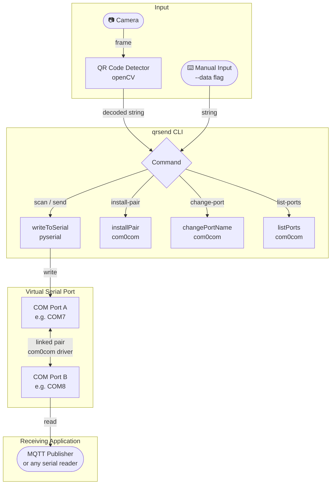

# QR Serial Port Simulator (`qrsend`)

A command-line tool for simulating QR code scanning on Windows and transmitting the decoded data through a serial port. It uses com0com (Null-modem emulator) to create a virtual COM port pair, analogous to a physical TX/RX cable, enabling data communication without real hardware.

## Architecture



---

## Prerequisites

### Python 3.12.8
Download: [python.org/downloads/release/python-3128](https://www.python.org/downloads/release/python-3128/)

### com0com 2.2.2.0 (Signed Version)

Required for creating virtual COM port pairs on Windows. The **signed version** must be used to ensure compatibility with Windows 10/11 driver signature enforcement.

Download: [sourceforge.net — com0com 2.2.2.0 x64 signed](https://sourceforge.net/projects/com0com/files/com0com/2.2.2.0/)

Install by running `setup.exe` as Administrator.

> **Note:** The unsigned version will fail silently on Windows 10/11. Ports will appear in Device Manager under `com0com - serial port emulators` with warning icons (⚠) and will not be accessible as COM ports.

---

## Installation

```bash
# Create and activate virtual environment
python -m venv .venv
.venv\Scripts\activate

# Install dependencies
python -m pip install -r requirements.txt
```

---

## Usage

All commands are run via:

```bash
python run.py <command> [options]
```

Or if built as an executable:

```bash
qrsend <command> [options]
```

---

### Commands

#### `scan` — Scan QR code from camera and send to serial port

Opens the default camera and waits for a QR code to be detected. Once detected, the decoded data is transmitted to the specified COM port.

```bash
python run.py scan --port <COM> [--baud <rate>]
```

| Option | Required | Default | Description |
|--------|----------|---------|-------------|
| `--port` | Yes | — | Target COM port (e.g. `COM7`) |
| `--baud` | No | `9600` | Baud rate |

**Example:**
```bash
python run.py scan --port COM7
python run.py scan --port COM7 --baud 115200
```

---

#### `send` — Send a string directly to serial port

Transmits a specified string to the COM port without using the camera. Useful for testing the receiving application independently.

```bash
python run.py send --port <COM> --data <string> [--baud <rate>]
```

| Option | Required | Default | Description |
|--------|----------|---------|-------------|
| `--port` | Yes | — | Target COM port (e.g. `COM7`) |
| `--data` | Yes | — | String to transmit |
| `--baud` | No | `9600` | Baud rate |

**Example:**
```bash
python run.py send --port COM7 --data "ITEM-00123"
python run.py send --port COM7 --data "ITEM-00123" --baud 115200
```

---

#### `list-ports` — List available virtual COM ports

Displays all virtual COM port pairs currently registered by com0com.

```bash
python run.py list-ports
```

**Example output:**
```
CNCA0 PortName=COM7,EmuBR=yes
CNCB0 PortName=COM8,EmuBR=yes
```

> Requires Administrator privileges. A UAC prompt will appear if not running as Administrator.

---

#### `install-pair` — Create a new virtual COM port pair

Registers a new virtual COM port pair via com0com. Both ports are linked — data written to port A is readable from port B, and vice versa.

```bash
python run.py install-pair --port-a <COM> --port-b <COM> [--emubr]
```

| Option | Required | Default | Description |
|--------|----------|---------|-------------|
| `--port-a` | Yes | — | Name for port A (e.g. `COM7`) |
| `--port-b` | Yes | — | Name for port B (e.g. `COM8`) |
| `--emubr` | No | Off | Enable baud rate emulation — data flows at the actual configured baud rate, simulating real serial timing |

**Example:**
```bash
# Create a pair without baud rate emulation
python run.py install-pair --port-a COM7 --port-b COM8

# Create a pair with baud rate emulation enabled
python run.py install-pair --port-a COM7 --port-b COM8 --emubr
```

> Requires Administrator privileges.

---

#### `change-port` — Rename a virtual COM port

Assigns or changes the COM port name for an existing com0com port identifier.

```bash
python run.py change-port --id <identifier> --name <COM>
```

| Option | Required | Description |
|--------|----------|-------------|
| `--id` | Yes | com0com port identifier (e.g. `CNCA0`, `CNCB0`) |
| `--name` | Yes | New COM port name (e.g. `COM7`) |

**Example:**
```bash
python run.py change-port --id CNCA0 --name COM7
python run.py change-port --id CNCB0 --name COM8
```

> Requires Administrator privileges.

---

## Quick Start

```bash
# Step 1 — Create a virtual port pair
python run.py install-pair --port-a COM7 --port-b COM8 --emubr

# Step 2 — Verify the pair was created
python run.py list-ports

# Step 3 — Open your receiving application on COM8

# Step 4a — Send a test string
python run.py send --port COM7 --data "ITEM-00123"

# Step 4b — Or scan a QR code from camera
python run.py scan --port COM7
```

---

## Build as Executable

```bash
python -m pip install pyinstaller --break-system-packages

pyinstaller --onefile --name qrsend --paths src src/app.py
```

Output: `dist\qrsend.exe`

```bash
dist\qrsend.exe --help
dist\qrsend.exe send --port COM7 --data "ITEM-00123"
```

---

## Project Structure

```
qr-serial-port-simulator/
├── src/
│   ├── app.py                  # CLI entry point
│   └── services/
│       ├── camera.py           # QR code detection via OpenCV
│       ├── serial_port.py      # Serial port write
│       └── com0com.py          # com0com driver wrapper
├── run.py                      # Development entry point
├── requirements.txt
└── README.md
```

---

## Dependencies

| Package | Purpose |
|---------|---------|
| `opencv-python` | Camera access and QR code detection |
| `pyserial` | Serial port communication |
